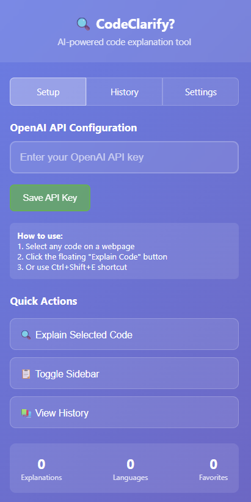
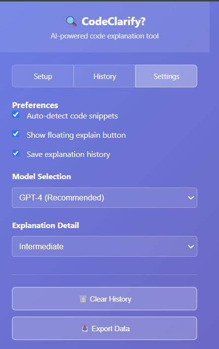

# CodeClarify – AI-Powered Code Explainer Extension

**CodeClarify** is a smart, developer-friendly Chrome extension that leverages OpenAI's GPT models to instantly explain code snippets on any webpage. With interactive features and a non-intrusive design, it transforms how developers understand unfamiliar code.

---

## 🚀 Features

### 🎯 Key Capabilities

#### 🔍 Smart Code Detection

Seamlessly scans and detects code blocks on any webpage.

#### 🤖 AI-Powered Explanations

Uses OpenAI's GPT models (via LangChain) to explain code logic in natural language. Easily configurable.

#### 🧠 Follow-up Q&A

Ask questions about the explanation for deeper clarity and context.

#### 🧩 Multiple Interaction Modes

Access explanations through:

- Floating action button
- Context menu right-click
- Custom keyboard shortcuts

#### 🖼️ Non-Intrusive Sidebar UI

A sleek, resizable sidebar appears beside the code. Fully themeable.

#### 📈 Usage History & Analytics

View your explanation history, export insights, and manage stored sessions.

#### 💻 Responsive Design

Works on both desktop and mobile web browsers.

#### 🔒 Security-First Architecture

All explanations are processed locally where possible. No data is collected without explicit user consent.

---

## 🛠️ Core Files & Structure

| File/Component            | Description                                                            |
| ------------------------- | ---------------------------------------------------------------------- |
| `manifest.json`           | Extension manifest file defining permissions, scripts, and structure.  |
| `langchain-service.js`     | Integrates LangChain + OpenAI API for contextual code explanations.    |
| `content.js`        | Injected into web pages to detect code and manage sidebar UI.          |
| `popup.html` / `popup.js` | Provides extension popup interface for quick settings and info.        |
| `content.css`       | Custom CSS for the sidebar and in-page UI.                             |
| `background.js`           | Manages lifecycle, permissions, and API coordination.                  |
| `options.html`            | Interface for advanced configuration, API keys, and theme preferences. |
|               |

---

## 🧑‍💻 How It Works

1. Select or hover over code on any webpage.
2. Trigger **CodeClarify** via button, shortcut, or right-click.
3. Instantly see a sidebar with AI-generated explanations.
4. Ask follow-up questions directly in the panel.
5. View and export your history of explanations from the popup menu.

---

## 📦 Installation

```bash
git clone https://github.com/yourusername/CodeClarify.git
cd CodeClarify
```

1. Go to `chrome://extensions/` in your browser.
2. Enable **Developer Mode**.
3. Click **Load Unpacked** and select the project directory.
4. Done! Start using **CodeClarify**.

---

## 🧩 Tech Stack

- **HTML** (UI structure and markup)  
- **LangChain + OpenAI GPT APIs**  
- **JavaScript** (Vanilla + Modular Scripts)  
- **Chrome Extension APIs** (Manifest V3)  
- **CSS3** (Modular, Theme Support)  
---

## 📊 Demo

<div align="center" style="display: flex; justify-content: center; gap: 20px;">
  
  
</div>


---

